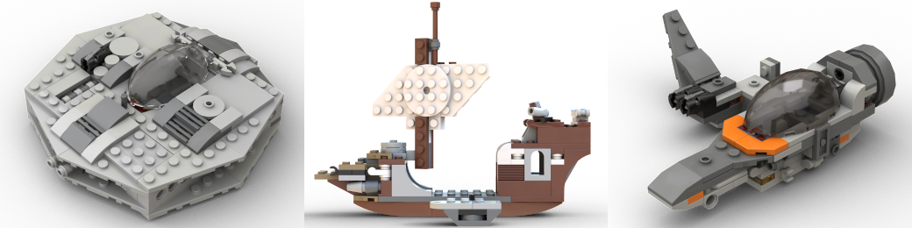

## [Blog](https://oliz.io/blog/)

## Personal Projects

* [Zeitgeist](https://oliz.io/zeitgeist/), [Investments](https://oliz.io/zeitgeist/investments.html), [Weather](https://oliz.io/zeitgeist/weather.html) *news aggregator*
* [Good Generator](https://oliz.io/ggpy/) *static site generator*
* [txt2sprite](https://github.com/ooz/txt2sprite) *text to image generator*
* [Lifetime Clock](https://oliz.io/lifetime-clock/?headline=Olli%27s%20Zeit&workingHoursPerWeek=32&regularHoursPerWeek=77&hourlyNet=18.10&angus) *countdown to end of life*

## Games and Global Game Jams

* [BotMos: Tr@ces](https://botmos.org/traces/) (2022)
* [NetMons](https://netmons.net) (2022)
* [Pompous Presentation Karaoke Generator](https://github.com/ooz/ppkg) (2021)
* [Ogre Forge](https://oliz.io/ogre-forge/) (2020)
* [home is](https://oliz.io/home-is/) (2019)
* [Handshake](https://oliz.io/handshake/) (2018)

## Other Creative Works

* [Soul Drainers](https://oliz.io/art/soul-drainers/) (Warning: high resolution photos!)

