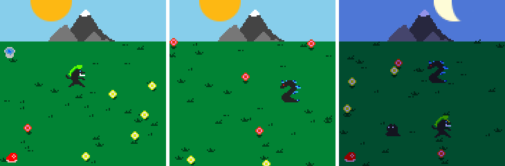
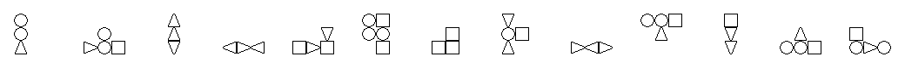

## [Blog](https://oliz.io/blog/)

## Projects

* [Zeitgeist](https://oliz.io/zeitgeist/), [Investments](https://oliz.io/zeitgeist/investments.html), [Weather](https://oliz.io/zeitgeist/weather.html)
* [Good Generator](https://oliz.io/ggpy/)
* [txt2sprite](https://github.com/ooz/txt2sprite)
* [Lifetime Clock](https://oliz.io/lifetime-clock/?headline=Olli%27s%20Zeit&workingHoursPerWeek=35&regularHoursPerWeek=77&hourlyNet=16.10&angus)

## Creative

Global Game Jams:

* [NetMons](https://netmons.net) (2022) 
* [Pompous Presentation Karaoke Generator](https://github.com/ooz/ppkg) (2021)
* [Ogre Forge](https://oliz.io/ogre-forge/) (2020)
* [home is](https://oliz.io/home-is/) (2019)
* [Handshake](https://oliz.io/handshake/) (2018)

Writing (besides the [above blog](https://oliz.io/blog/)):

* WIP: [Axioms for Humans](https://oliz.io/axioms/)

Other:

* [Soul Drainers](https://oliz.io/art/soul-drainers/) (Warning: high resolution photos!)
* [Lego Designs](https://oliz.io/mocs/)

